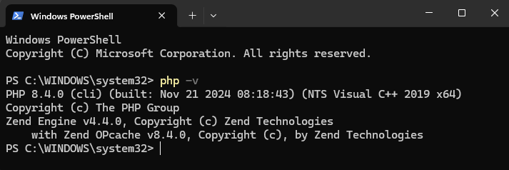
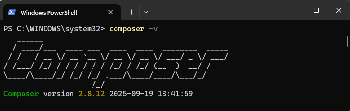
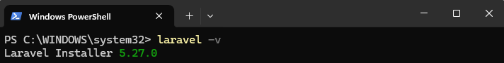
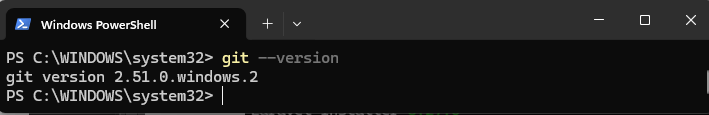
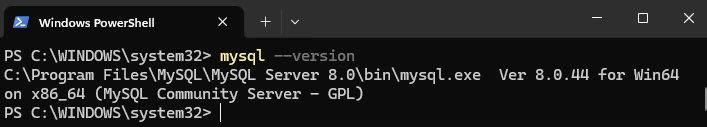
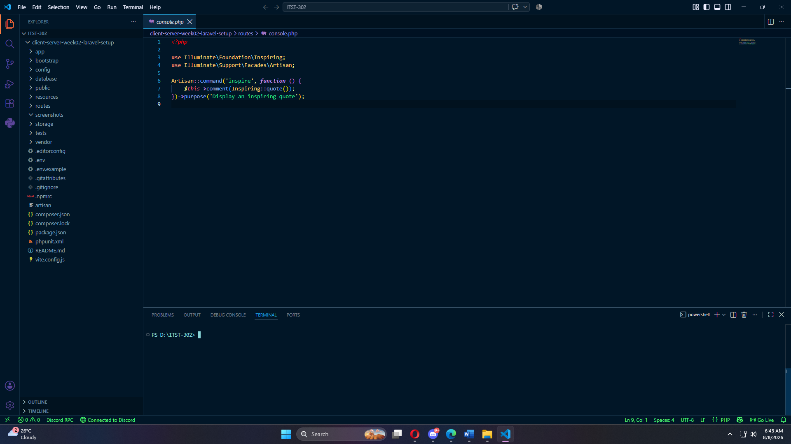
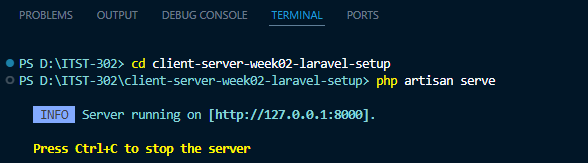
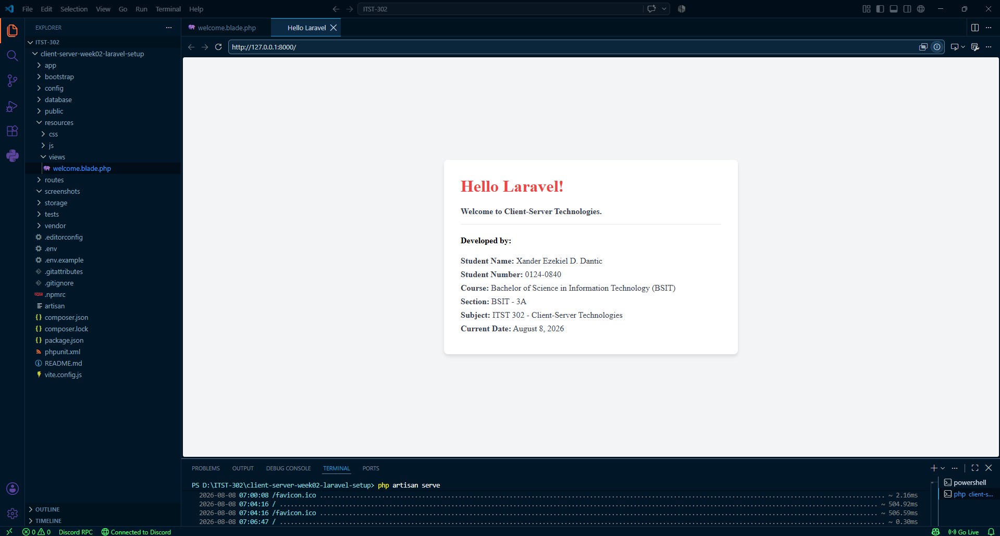

# ITST 302 — Professional Laravel Development Environment Setup

## 1. Project Title

**Hello Laravel — Client-Server Development Environment Setup**

**Subject:** ITST 302 — Client-Server Technologies  
**Project:** Mini Project 01: Professional Laravel Development Environment  
**Course:** Bachelor of Science in Information Technology (BSIT)  

---

## 2. Introduction

### Overview of Laravel
Laravel is an open-source PHP web framework engineered to streamline modern web application development through an elegant, expressive syntax. Operating primarily on the Model-View-Controller (MVC) architectural pattern, Laravel handles routing, request processing, database abstraction, and view rendering out of the box, allowing developers to build scalable enterprise solutions efficiently.

### Importance of Client-Server Technologies
Client-server architecture is the structural backbone of modern web computing. In this model, the client (browser) sends HTTP requests across a network, while the server processes business logic, interacts with database layers, and returns appropriate HTTP responses. Understanding how to configure server-side runtime environments and manage local databases is essential for developing robust backend systems.

### Purpose of the Project
This project was completed for the ITST 302 Client-Server Technologies laboratory assignment. The objective is to construct, verify, and document a fully functional local development environment. This includes configuring PHP, Composer, Laravel CLI, Git, and MySQL, running the local Artisan development server, customizing a dynamic Blade template, and managing code history through Git and GitHub.

---

## 3. Objectives

The following learning objectives were achieved upon completion of this activity:

1. Installed and configured PHP 8.4 as the core server-side scripting environment.
2. Verified Composer as the global dependency manager for PHP packages.
3. Installed and verified the Laravel CLI installer globally.
4. Installed, configured, and verified MySQL Community Server 8.0 for database management.
5. Configured Git version control and established proper commit conventions.
6. Initialized and opened the project inside Visual Studio Code as the primary IDE.
7. Generated a clean Laravel project (`hello-laravel`) using Composer.
8. Initiated the application locally using the `php artisan serve` development server.
9. Customized the default Blade view (`welcome.blade.php`) with dynamic metadata and styling.
10. Maintained structured version control with a minimum of 5 meaningful Git commits.

---

## 4. Development Environment

The local setup was built and verified using the following technologies:

| Tool / Component | Version |
| :--- | :--- |
| Operating System | Windows 11 |
| PHP | 8.4.0 |
| Laravel Installer | 5.27.0 |
| Composer | 2.8.12 |
| Git | 2.51.0 |
| MySQL | 8.0.44 |
| Visual Studio Code | 1.132.0 |

### PHP Environment
PHP 8.4.0 is managed seamlessly through Laravel Herd Lite, providing a fast, isolated runtime for executing server-side logic and handling CLI tasks.

### Composer
Composer 2.8.12 serves as the dependency manager, managing global PHP binaries and project package installations.

### Laravel
The application utilizes Laravel Framework (initialized via Laravel Installer 5.27.0) to route incoming requests and serve dynamic Blade views.

### Git & GitHub
Git 2.51.0 was configured for version control to track project iterations and publish the repository publicly to GitHub.

### MySQL Database
MySQL Community Server 8.0.44 was installed alongside system PATH variables to provide relational database capabilities.

---

## 5. Installation & Verification Steps

### Step 1 — Verify PHP Version
The PHP CLI runtime was verified in PowerShell:

```powershell
php -v
```

This confirmed that PHP 8.4.0 was active via Herd Lite's binary directory.

  
*Figure 1. Verification of PHP 8.4.0 installation.*

---

### Step 2 — Verify Composer Installation
Composer was verified using:

```powershell
composer -V
```

This output confirmed Composer 2.8.12 was operating on top of the PHP 8.4 runtime.

  
*Figure 2. Verification of Composer dependency manager.*

---

### Step 3 — Verify Laravel Installer
The global Laravel CLI tool was verified using:

```powershell
laravel -V
```

This confirmed Laravel Installer 5.27.0 was installed and ready to scaffold new applications.

  
*Figure 3. Verification of global Laravel CLI.*

---

### Step 4 — Verify Git Version Control
Git installation and system identity were verified using:

```powershell
git --version
```

  
*Figure 4. Verification of Git version control system.*

---

### Step 5 — Verify MySQL Server
MySQL binary availability was verified in the terminal using:

```powershell
mysql --version
```

This confirmed MySQL Community Server 8.0.44 was properly bound to the system PATH.

  
*Figure 5. Verification of MySQL database server.*

---

### Step 6 — Verify Visual Studio Code Setup
The project folder was opened in Visual Studio Code to verify workspace configurations and workspace extensions.

  
*Figure 6. Workspace structure opened inside VS Code.*

---

### Step 7 — Create the Laravel Project
A fresh Laravel project named `hello-laravel` was initialized using Composer:

```powershell
composer create-project laravel/laravel hello-laravel
```

---

### Step 8 — Start Development Server
The local server was started using Artisan:

```powershell
php artisan serve
```

The application started listening on `http://127.0.0.1:8000`.

  
*Figure 7. Laravel Artisan development server running.*

---

### Step 9 — Customize Application Homepage
The landing page was customized by modifying `resources/views/welcome.blade.php`. Custom CSS and dynamic Carbon date formatting were included to present student metadata cleanly.

  
*Figure 8. Customized Laravel application landing page.*

---

## 6. Project Structure Overview

Laravel follows a structured directory layout where each folder plays a distinct role in application architecture:

* **`app/`**: Contains core application code including HTTP Controllers, Eloquent Models, and Middleware.
* **`routes/`**: Holds route definition files. Web routes served to browsers are defined inside `routes/web.php`.
* **`resources/`**: Houses raw uncompiled assets, language files, and Blade views (`resources/views/`).
* **`public/`**: Serving as the document root, this folder contains `index.php`, the main entry point for incoming HTTP requests.
* **`config/`**: Contains environment configurations for database access, authentication, mail, and application settings.
* **`database/`**: Contains database migrations, database seeders, and factory definitions for managing data models.

---

## 7. Problems Encountered

1. **MySQL Command Not Recognized (`CommandNotFoundException`):**  
   Initial execution of `mysql --version` in PowerShell resulted in a term recognition error. Although the MySQL server was installed, the binary execution path was missing from the Windows System Environment Variables.

2. **MySQL Access Denial on Direct Command Call:**  
   Running `mysql.exe` directly threw `ERROR 1045 (28000): Access denied for user 'ODBC'@'localhost'`. The CLI defaulted to an unauthorized guest account because standard user credentials (`-u root -p`) were omitted.

3. **PATH Synchronization in Terminal Sessions:**  
   Modifying Environment Variables in Windows did not immediately reflect in already opened PowerShell windows, causing commands to continue failing until the terminal was restarted.

---

## 8. Solutions

1. **Configuring System Environment Variables for MySQL:**  
   Located `mysql.exe` under `C:\Program Files\MySQL\MySQL Server 8.0\bin` and added the directory directly to the system `Path` variable using PowerShell:
   ```powershell
   [Environment]::SetEnvironmentVariable("Path", $env:Path + ";C:\Program Files\MySQL\MySQL Server 8.0\bin", "User")
   ```

2. **Correcting Version Command Flags:**  
   Ran `mysql --version` specifically to request version metadata without attempting an unauthorized user login handshake.

3. **Refreshing Terminal Environment:**  
   Completely closed and restarted PowerShell instances after setting system environment variables, allowing the terminal session to register the updated `PATH` definitions.

---

## 9. Screenshots Summary

| Screenshot Asset | Visual Preview | Description |
| :--- | :---: | :--- |
| **PHP Version** |  | Verifies PHP 8.4.0 CLI installation via Herd Lite. |
| **Composer Version** |  | Displays Composer 2.8.12 package manager setup. |
| **Laravel Version** |  | Displays global Laravel Installer version 5.27.0. |
| **Git Version** |  | Verifies Git 2.51.0 version control environment. |
| **MySQL Version** |  | Confirms MySQL 8.0.44 server installation. |
| **VS Code Setup** |  | Shows project structure active in VS Code. |
| **Artisan Serve** |  | Demonstrates `php artisan serve` listening on port 8000. |
| **Homepage** |  | Displays the final customized Blade homepage view. |

---

## 10. Reflection

Setting up a complete development environment provided valuable insights into how server-side frameworks operate behind the scenes. Before writing any code, ensuring that all dependent software such as PHP runtimes, package managers, database systems, and version control tools—are harmonized is a vital step in real-world software engineering.

One major takeaway from this activity was understanding how tool suites like Laravel Herd Lite handle environment variables. Herd Lite simplifies local setup by managing PHP binaries and Composer paths automatically. Additionally, resolving the terminal PATH issues with MySQL highlighted the importance of system configurations and showed how terminal sessions load environment states upon launch.

Gaining familiarity with Laravel's directory hierarchy—specifically how routes in `routes/web.php` map to Blade views in `resources/views/` helped clarify the mechanics of client-server request handling. Learning to track these incremental setup steps using professional Git commit practices reinforced the importance of maintainable code documentation. These foundational concepts will serve as a strong basis for upcoming enterprise web development tasks and database integrations.

---

## 11. References

* Composer. (n.d.). *Composer documentation*. https://getcomposer.org/doc/
* Git. (n.d.). *Git documentation*. https://git-scm.com/doc
* Laravel. (n.d.). *Laravel documentation*. https://laravel.com/docs
* Oracle. (n.d.). *MySQL 8.0 reference manual*. https://dev.mysql.com/doc/refman/8.0/en/
* PHP Group. (n.d.). *PHP documentation*. https://www.php.net/docs.php